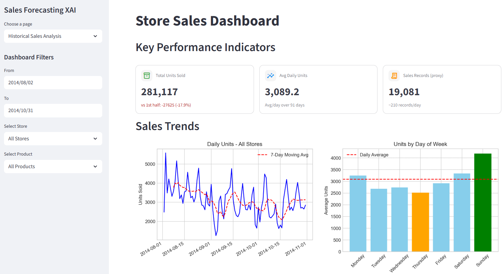
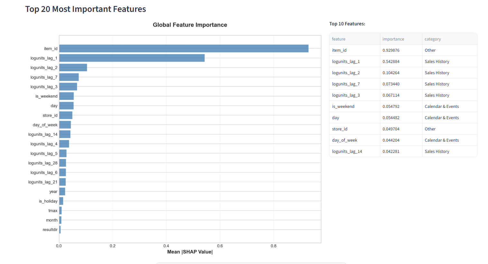

# Frontend Dashboard (Streamlit)

Interactive dashboard for sales forecasting visualization and XAI insights, powered by the Backend API.



## Features

- **Sales Forecast** — Visualize predicted sales over a selected time horizon.

  

- **XAI Dashboard** — SHAP-based explanations (local & global) for model predictions.

  

- **VLM Integration** — Natural language summaries of model insights via Gemini AI.

  

---

## Project Structure

```
web_ui/
├── src/
│   ├── app.py              # Streamlit entry point, page routing
│   ├── config.py           # Settings and constants
│   ├── components/
│   │   ├── ui_builder/     # Historical data & analytics views
│   │   ├── ui_predictor/   # Sales forecast UI
│   │   └── ui_xai/         # SHAP and XAI explanation views
│   ├── services/
│   │   └── api_client.py   # HTTP client for the Backend API
│   └── utils/              # Shared helpers
├── pyproject.toml
└── .env.example
```

---

## Quick Start

### 1. Install dependencies

```bash
uv sync
```

### 2. Configure environment

```bash
cp .env.example .env
```

| Variable        | Description                        | Default                 |
|-----------------|------------------------------------|-------------------------|
| `API_BASE_URL`  | Backend API base URL               | `http://localhost:8000` |
| `GEMINI_API_KEY`| Google Gemini API key (VLM/XAI)    | *(required)*            |

> **Prerequisite:** The [Backend API](../backend/README.md) must be running before launching the dashboard.

### 3. Run the app

```bash
uv run streamlit run src/app.py
```

Opens at `http://localhost:8501`.
